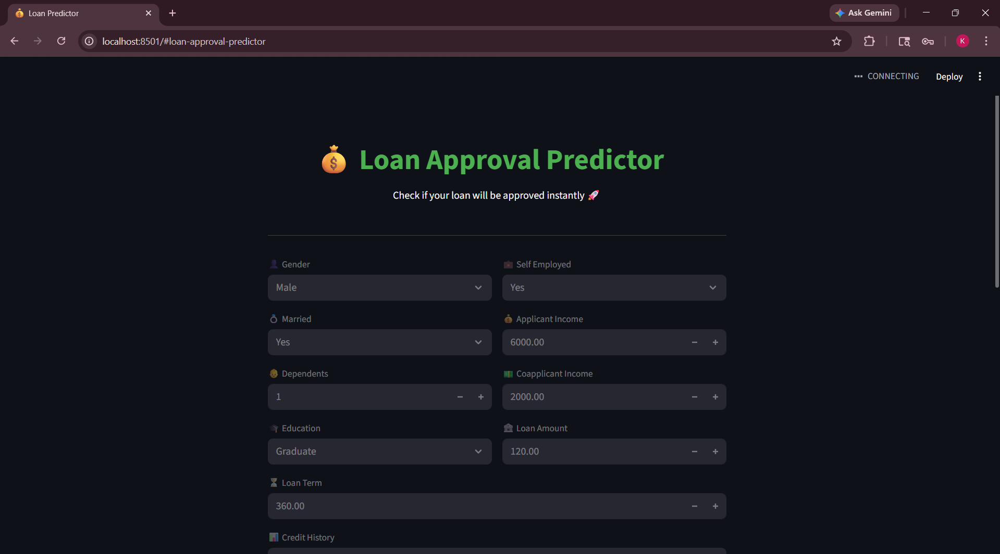
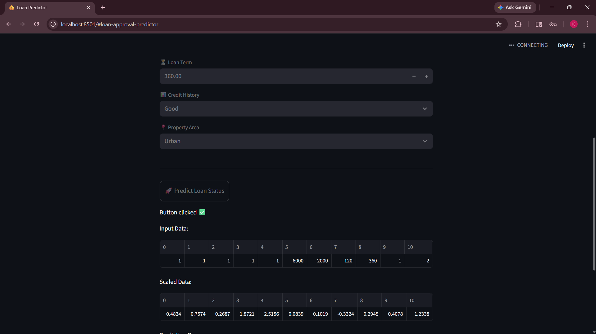
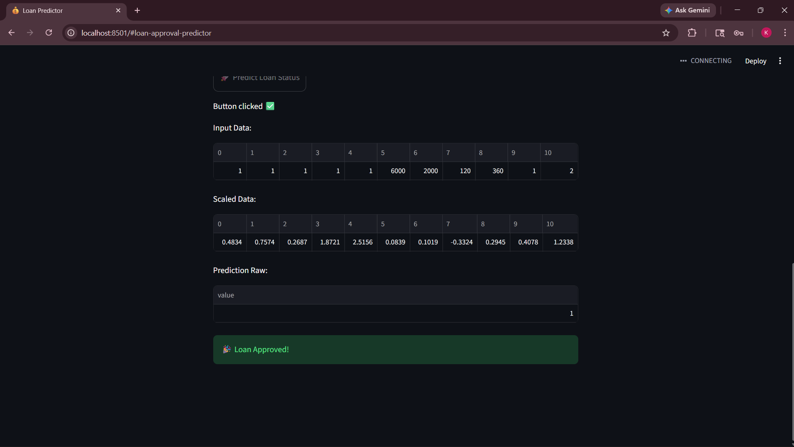

# 💰 Loan Approval Prediction App

An end-to-end Machine Learning project that predicts whether a loan will be approved or not based on user inputs.

---

## 🚀 Features

* Data Cleaning & Preprocessing
* Handling Missing Values
* Feature Encoding & Scaling
* Model Training (Logistic Regression & Random Forest)
* Interactive Web App using Streamlit

---

## 📊 Model Performance

* Best Model: Logistic Regression
* Accuracy: ~79%

---

## 🖥️ App Preview







---
## 🌍 Live Demo

🔗 (https://loan-approval-predictor-01.streamlit.app/)
---

## 🛠 Tech Stack

* Python
* Pandas
* Scikit-learn
* Streamlit

---

## 📂 Project Structure

Loan-Approval-ML/
│── data/
│── models/
│── notebooks/
│── app/
│── README.md

---

## ▶️ How to Run

```bash
git clone https://github.com/kashish836/Loan-Approval-ML.git
cd Loan-Approval-ML/app
streamlit run app.py
```

---

## 💡 Learnings

This project helped me understand the complete ML lifecycle — from data preprocessing to deployment.

---

## 🔗 GitHub Repo

🔗 GitHub Repo: [Loan Approval ML Project](https://github.com/kashish836/Loan-Approval-ML)
